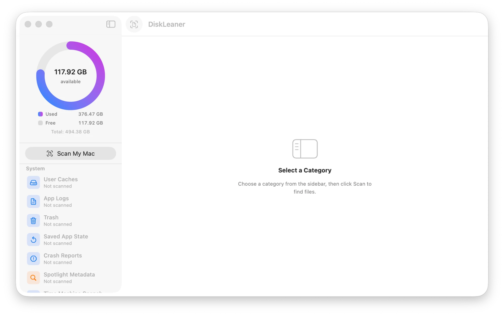
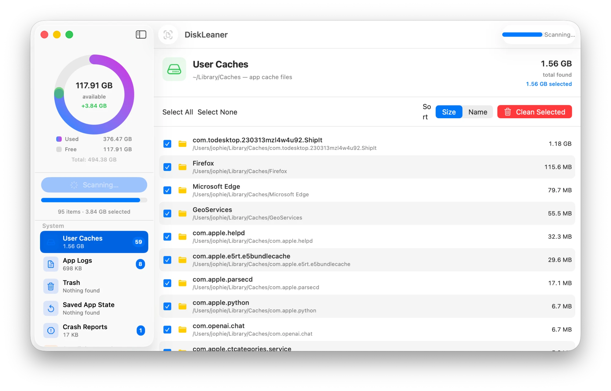

# DiskLeaner

A fast, local macOS disk cleaning utility. Scans your Mac for junk, caches, logs, and developer artifacts — lets you review everything before deleting anything.

| | |
|---|---|
|  |  |

---

## Features


- **48 cleanup categories** across System, Apple Apps, Communication, Developer, Containers & VMs, and Leftovers
- **Donut ring** showing disk usage and how much space you're about to free
- **Parallel scanning** — all categories scan concurrently, results populate as they arrive
- **Select before you delete** — every item is listed with its path and size; nothing is removed without confirmation
- **Safe defaults** — items are moved to Trash unless you explicitly choose permanent deletion
- **Admin-level cleaning** — optionally removes system caches, old macOS updates, and other protected files via a single password prompt
- **Live progress overlay** during cleaning with per-item feedback and percentage
- **Detailed result sheet** — shows exactly what was cleaned and explains any failures

---

---

## Installation

**Requirements:** macOS 13 Ventura or later, Xcode Command Line Tools

```bash
# Clone
git clone https://github.com/geophil/diskleaner.git
cd diskleaner

# Build and install to /Applications
./install.sh
```

`install.sh` compiles a release binary, wraps it in a `.app` bundle, and installs it to `/Applications/DiskLeaner.app`. Run it again any time you pull new changes.

For a quick debug run without installing:
```bash
./run.sh
```

---

## Full Disk Access

For the deepest scan results, grant Full Disk Access:  
**System Settings → Privacy & Security → Full Disk Access → add DiskLeaner**

Without it, system-level paths (Mail, Safari cookies, TCC database, etc.) will be skipped. The app works without it — you'll just see fewer results in some categories.

---

## What gets cleaned

### System
User caches (`~/Library/Caches`), system logs, crash reports, Spotlight metadata, Trash, saved application state, Quick Look thumbnails, and Time Machine local snapshots.

### Apple Apps
Safari, Mail, Photos, Apple Music, Podcasts, News, Xcode, iOS device backups, and iOS firmware files.

### Communication
Slack, Zoom, Discord, and Microsoft Teams caches.

### Developer
Xcode DerivedData, simulators, and archives. Package manager caches for npm, Yarn, pip, Homebrew, Gradle, Maven, Cargo, and Go. Automatically finds `node_modules` and Python virtual environments anywhere under your home folder.

### Containers & VMs
Docker images and build cache. OrbStack and Colima data. Orphaned containers.

### Leftovers
Orphaned app support folders for apps that are no longer installed. JetBrains, VS Code, Cursor, Zed, Android Studio caches. CocoaPods, Flutter, Terraform, nvm, Ruby gems, Conda, and more.

---

## Architecture

Built entirely with Swift and SwiftUI — no dependencies, no App Store sandboxing.

```
Sources/DiskLeaner/
├── App.swift                     Entry point, menu bar
├── ContentView.swift             NavigationSplitView, toolbar, confirm/result sheets
├── Models/
│   └── Models.swift              CleanupItem, CleanupCategory, CleanResult, DeleteStrategy
├── Scanner/
│   ├── CategoryScanner.swift     Per-category scan logic (48 categories)
│   └── DiskScanner.swift         ObservableObject coordinator, async scan + clean
├── Utils/
│   └── Formatters.swift          Byte count formatting
└── Views/
    ├── SidebarView.swift          Category list with badges and disk ring
    ├── DetailView.swift           Item list with checkboxes and sort controls
    ├── DiskRingView.swift         Animated donut chart
    ├── ConfirmSheet.swift         Per-category delete confirmation
    ├── CleaningProgressOverlay.swift  Full-window cleaning progress card
    └── CleanResultSheet.swift     Post-clean summary with failure details
```

**Key design decisions:**

- **Thread safety** — file I/O runs on `Task.detached(priority: .userInitiated)` so the UI stays responsive during long deletes. Shell commands use `withCheckedThrowingContinuation` on a background `DispatchQueue`.
- **Parallel scanning** — `withTaskGroup` runs all 48 category scans concurrently; the sidebar populates in real time as results arrive.
- **Admin batching** — all admin-level items are combined into a single AppleScript call, so you only see one password prompt regardless of how many protected categories you clean.
- **No auto-rescan after clean** — apps like Teams recreate their caches immediately; auto-rescanning would make deleted items reappear. Items are removed from the list directly on success instead.
- **Safe DeleteStrategy** — each category declares `.trash`, `.permanent`, or `.shell(command)` / `.adminShell(command)` independently, so risky categories can't accidentally use a safer-than-intended strategy.

---

## License

MIT
